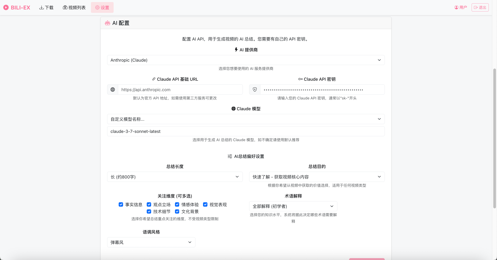

# bili-ex

bili-ex 是一个功能强大的B站视频多媒体处理工具，提供Web界面，支持视频下载、音频提取、字幕获取，并具有AI智能总结功能（支持OpenAI和Claude）。

<p align="center">
  
</p>

## ✨ 主要功能

- 📹 **视频下载**：下载B站视频，自动转为MP4格式，并提取封面图
- 🔊 **音频提取**：将视频转换为MP3格式音频
- 📝 **字幕处理**：
  - 支持UP主上传的字幕
  - 支持B站AI自动生成的字幕（需登录）
  - 自动转换为SRT格式，便于阅读和编辑
- 🤖 **AI智能总结**：
  - 使用AI分析字幕内容，生成视频内容摘要
  - 提取关键点并标注时间戳和重要性
  - 支持OpenAI和Claude两种AI后端
  - 自定义总结风格、长度和关注点
  - 解释术语、标记难度级别和适合人群
- 🖼️ **视频预览**：
  - 自动生成BIF预览文件（类似Netflix/YouTube预览）
  - 鼠标悬停即可预览关键点对应视频片段
- 🔗 **视频元数据**：自动保存封面、创建者信息和视频描述
- 🔒 **安全访问**：支持密码保护访问
- 📱 **响应式设计**：良好支持手机和平板访问

## 🚀 快速开始

### 使用Docker Compose（推荐）

1. 克隆仓库：
   ```bash
   git clone https://github.com/xiaobaiya8/bili-ex.git
   cd bili-ex
   ```

2. 启动容器：
   ```bash
   docker-compose up -d
   ```

3. 访问Web界面：`http://localhost:9160`

4. 使用默认密码登录：`admin`（首次登录请及时修改密码）

## 💡 使用说明

### 下载视频

1. 在"下载"页面输入B站视频链接或BV号
2. 勾选需要的内容（视频/音频/字幕/AI总结）
3. 点击"开始下载"按钮
4. 在"视频列表"页面查看下载状态和结果

### 设置Cookie

为了获取需要登录才能访问的资源（如AI生成的字幕），您需要：

1. 登录B站网页版 https://www.bilibili.com/
2. 使用浏览器开发者工具获取Cookie（F12 → 网络/Network → 刷新页面 → 找到任意B站请求 → 复制Cookie）
3. 在设置页面粘贴Cookie并保存

### 配置AI总结

系统支持两种AI后端进行视频总结：

<p align="center">
  
</p>

1. **OpenAI**：
   - 支持GPT-3.5和GPT-4等模型
   - 需提供API密钥和基础URL
   - 支持自定义模型名称

2. **Claude**：
   - 支持Claude-3系列模型
   - 需提供API密钥和基础URL
   - 支持自定义模型名称

3. **总结偏好设置**：
   - 长度：简短/中等/详细
   - 内容侧重：核心观点/技术细节/实用技巧等
   - 术语解释：不同详细程度
   - 语言风格：休闲/正式/技术等
   - 用途：学习/娱乐/工作等

## 🔧 高级配置

### 持久化存储

下载的文件存储在Docker卷中，默认路径如下：

```
./config/download/[视频标题]/
├── [BV号].mp4       # 视频文件
├── [BV号].mp3       # 音频文件
├── [BV号].srt       # 字幕文件
├── [BV号]_ai_summary.json  # AI总结
├── [BV号].bif       # 视频预览文件
├── poster.jpg       # 视频封面
└── movie.nfo        # 视频元数据
```

### Emby/Jellyfin 媒体服务器支持

bili-ex 下载的视频文件和元数据完全兼容 Emby/Jellyfin 媒体服务器标准，可以直接挂载使用：

#### 文件兼容性

- **视频文件**：标准MP4格式，包含正确的元数据
- **字幕文件**：SRT格式，自动与视频同名便于自动匹配
- **NFO元数据**：符合Emby/Jellyfin识别的XML格式，包含：
  - 视频标题、简介和时长
  - UP主信息（作为导演/创作者）
  - 发布日期和B站链接
  - 标签信息和类别
- **封面图片**：使用标准命名`poster.jpg`，自动被识别为封面
- **文件夹结构**：每个视频位于独立文件夹，符合电影库标准

#### 如何挂载到Emby/Jellyfin

1. **直接挂载Docker卷**（推荐）：
   
   在Emby/Jellyfin的Docker配置中，添加bili-ex的下载目录挂载：
   ```yaml
   volumes:
     - /path/to/bili-ex/config/download:/media/bilibili
   ```

2. **映射本地文件夹**：
   
   将bili-ex下载目录映射到Emby/Jellyfin服务器：
   ```bash
   # Linux/Mac
   ln -s /path/to/bili-ex/config/download /path/to/emby/media/bilibili
   
   # Windows
   mklink /D "C:\path\to\emby\media\bilibili" "C:\path\to\bili-ex\config\download"
   ```

3. **在Emby/Jellyfin中添加媒体库**：
   - 打开Emby/Jellyfin管理界面
   - 进入"媒体库" → "添加媒体库"
   - 内容类型选择"电影"或"视频"
   - 文件夹路径选择挂载的bili-ex下载目录
   - 启用"扫描元数据文件(nfo)"选项
   - 保存并等待媒体扫描完成

媒体库扫描完成后，B站视频将以精美封面和完整元数据展示在您的Emby/Jellyfin中，支持搜索和分类浏览。

### 环境变量

在`docker-compose.yml`中可配置以下环境变量：

- `DEV_MODE`: 设置为`true`时启用开发模式（默认`false`）

## 📚 技术实现

- **前端**: React + TypeScript + Bootstrap 5
- **后端**: Python + Flask
- **视频处理**: FFmpeg
- **容器化**: Docker + Docker Compose
- **AI处理**: OpenAI API / Claude API

## 📋 注意事项

- 本程序基于B站官方API获取视频信息
- 获取AI生成的字幕需要有效的B站Cookie
- 视频清晰度取决于B站的API配额和限制
- Cookie会定期失效，需要及时更新
- 仅供个人学习和非商业用途
- 请尊重创作者版权，不要随意传播下载内容

## 🤝 贡献

欢迎提交Issue和Pull Request，共同改进这个项目！
https://github.com/xiaobaiya8/bili-ex/issues

## 📄 许可

本项目采用 MIT 许可证 - 详见 [LICENSE](LICENSE) 文件 